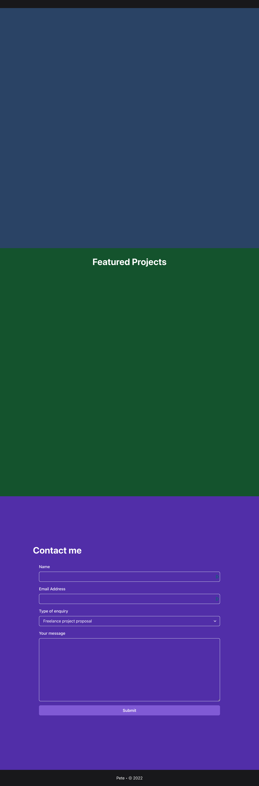
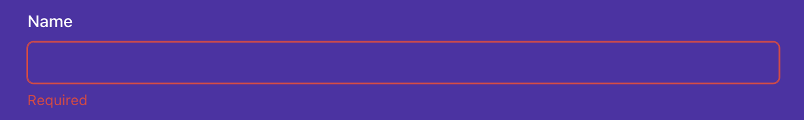

# PORTFOLIO PROJECT

## TAREA

En este laboratorio final, va a crear una página de portafolio para usted. Utilizará las habilidades que ha aprendido en este curso para crear una página que muestre su trabajo. La página del portafolio será una sola página que contendrá las siguientes secciones:

Una cabecera con enlaces externos a cuentas de redes sociales y enlaces internos a otras secciones de la página

Una sección de aterrizaje con una imagen de avatar y una breve biografía

Una sección para mostrar sus proyectos destacados como tarjetas en forma de cuadrícula

Una sección de contacto con un formulario para que los visitantes puedan ponerse en contacto con usted

Aquí tendrá la oportunidad de utilizar algunas librerías populares de código abierto que le ayudarán a tener una página más pulida y de aspecto profesional.

Antes de seguir adelante, hagamos una introducción a las bibliotecas que utilizará.

### Biblioteca

__Chakra UI__

Chakra UI viene preconfigurada con este laboratorio, por lo que no tendrá que preocuparse de instalarla o configurarla.

Los componentes de esta biblioteca que necesitará utilizar ya están importados del paquete ```@chakra-ui/react``` en la parte superior de cada archivo correspondiente. Si no ve un componente ya importado, es porque probablemente no lo necesite. En cualquier caso, no dude en consultar su
[documentación oficial](https://www.chakra-ui.com/docs/components)
 para ver todos los componentes a su disposición y sus accesorios correspondientes.

 __Formik y Yup__

 La librería Formik ya está configurada también en el proyecto, por lo que no es necesaria ninguna configuración extra. En este laboratorio, sólo utilizará el hook ```useFormik``` de la biblioteca Formik, así como el objeto global Yup para definir las reglas de validación del formulario Contact Me.

La interfaz de usuario del formulario se implementará utilizando componentes de interfaz de usuario Chakra.

 Si ejecuta ```npm start``` y ve la aplicación en el navegador, observará que la aplicación React inicial funciona tal cual.

La app muestra una página con una cabecera vacía, 3 secciones diferentes a toda altura y un pie de página. Cada sección tiene un color de fondo diferente. Las 2 primeras secciones estarán vacías y la tercera contendrá todos los elementos de la interfaz de usuario para el formulario Contacto.



## Pasos

Una vez que abra el laboratorio de código, necesita instalar Chakra UI y otras librerías referenciadas ejecutando el comandonpm install desde la terminal incorporada en el laboratorio de código. Para activar el terminal incorporado, debe hacer clic en el elemento de menú Ver y, a continuación, elegir el Terminal en el menú desplegable.

Una vez que el terminal esté abierto (visible), puede ejecutar el comando ```npm install```. Esto instalará todas las dependencias necesarias que faltan, para que pueda empezar a trabajar en la tarea.

### Paso 1

Abra el archivo ```Header.js```. Verá un componente de cabecera con fondo negro, pero sin contenido.

__a) Añada enlaces de medios sociales externos a la cabecera en la parte izquierda de la página.__

La aplicación debe colocarse dentro del primer elemento nav. Los datos ya se proporcionan en la matriz socials en la parte superior del archivo.

Utilice el componente ```HStack``` para apilar los enlaces horizontalmente. Cada social debe ser una etiqueta con un atributo href que apunte a la página de la red social correspondiente. Los a tag deben tener como hijos un componente FontAwesomeIcon, que ya está importado para usted.

El componente ```FontAwesomeIcon``` toma 2 props:

- icon:  El icono a mostrar. En este caso, debe utilizar la prop del icono del objeto social.  

- size: El tamaño del icono. Puede utilizar el valor 2x. 

Puede consultar a continuación un ejemplo de cómo renderizarlo:

    <FontAwesomeIcon icon="fab" size="2x">

__b)Añadir enlaces internos a la sección Proyectos y a la sección Contacto__


Cada enlace debe ser una ```tag```. Cadaa ```tag``` debe tener como hijos el nombre de la sección: "Contacto" y "Proyectos". Al hacer clic en el enlace, la url debe mostrar la sección correspondiente. Por ejemplo, al hacer clic en el enlace "Contacto", la ruta url debería ser ```/#contact-me```. Además, al hacer clic debería desplazarse hasta la sección correspondiente con una animación suave. El código para ello se le ha proporcionado a través de la función ```handleClick```. Necesita enganchar esa función con el eventoa tagonClick . Tenga en cuenta que la sección Proyectos tiene un id llamado ```projects-section``` y la sección Contacto tiene un ```id``` llamado ```contactme-section```.

Evite cualquier advertencia relacionada con las teclas al abrir la consola.

La interfaz de usuario final de la cabecera debería tener el siguiente aspecto:


### Paso 2

Abra el archivo ```LandingSection.js```. Implemente la siguiente UI para proporcionar una sección de aterrizaje para la aplicación con un avatar, un saludo y una breve descripción del rol. Para los datos, utilice las variables proporcionadas en la parte superior del archivo (saludo, bio1 y bio2) y no datos personales. Para el avatar puede utilizar la siguiente ```url:https://i.pravatar.cc/150?img=7``` Todos los componentes que necesita ya han sido importados para usted.


### Paso 3

Abra el componente ```ProjectsSection.js```. Este componente ya está implementado, sin embargo el componente Tarjeta que utiliza para mostrar información sobre cada proyecto no lo está. El componente Sección de Proyectos ya define un array de proyectos con los datos de cada proyecto y esa información se pasa a cada componente Tarjeta como props.

Abra el ```componenteCard.js``` e implemente la interfaz de usuario para la tarjeta. Cada tarjeta debe parecerse a la imagen de abajo:


Puede utilizar los siguientes componentes de Chakra UI que ya han sido importados para usted:

- ```HStack```,

- ```VStack```,

- ```Imagen```,

- ```Encabezado```,

- ```Texto```,

Para la flecha derecha, utilice el componente siguiente. Las importaciones necesarias ya están proporcionadas para usted también. ```<FontAwesomeIcon icon={faArrowRight} size="1x" />```

Evite cualquier advertencia relacionada con las teclas al abrir la consola.

### Paso 4

Abra el componente ```ContactMeSection.js```. Implemente el resto de requisitos del formulario de acuerdo con las especificaciones siguientes.

El formulario contiene 4 campos de entrada: nombre, dirección de correo electrónico, tipo de consulta y mensaje.

Toda la interfaz de usuario del formulario está definida para usted. Necesita implementar alguna lógica de negocio que falta.


__a)Añada la configuración adecuada al ganchouseFormik, pasándole un objeto con 3 propiedades: ```initialValues```,```onSubmit``` y ```validationSchema```.__

El objetoinitialValues debería tener los siguientes campos:

- firstName

- email

- type

- comment

La función ```onSubmit``` debería realizar una llamada a la API utilizando el ayudante de envío del gancho ```useSubmit```. Inspeccione el gancho personalizado ```useSubmit``` para ver los argumentos que espera la función submit.

El ```validationSchema``` debe ser un esquema Yup que valide los campos del formulario. Las reglas de validación son las siguientes:

- firstName

- email

- type

- comment

__b)Haga que los componentes Input sean componentes controlados por Chakra UI.__

```useFormik``` hook devuelve un objeto con una función llamada ```getFieldProps``` que al ser llamada, devuelve un objeto con los props necesarios para hacer el input controlado.

__c)Mostrar los mensajes de error de cada campo cuando se toca el campo y falla la validación.__

Cada campo se agrupa en un componente ```FormControl```. El componente ```FormControl``` toma una prop ```isInvalid``` que puede utilizar para mostrar el mensaje de error.

La prop ```isInvalid``` debe ser verdadera cuando se toca el campo y falla la validación.

El componente ```FormErrorMessage``` de Chakra UI debe mostrar el mensaje de error correspondiente si la prop ```isInvalid``` del componente padre ```FormControl``` es verdadera.

A continuación se muestra un ejemplo de cómo debe mostrarse la UI cuando falla la validación del campo ```firstName```:




__d) Conectela proponSubmit del formulario con la funciónhandleSubmit de Formik.__

Asegúrese de que se impide el comportamiento predeterminado del formulario HTML cuando se produce un envío.

__e)Muestre una alerta cuando el formulario se envíe correctamente.__

Necesita escuchar los cambios en el objeto de respuesta desde el gancho ```useSubmit```. Además, cuando se envíe el formulario, deberá mostrarse un indicador de carga en el botón Enviar. Puede utilizar la propiedad ```isLoading``` del gancho ```useSubmit```.

El gancho ```useSubmit``` está implementado de forma que el 50% de las veces devolverá una respuesta correcta y el 50% de las veces devolverá una respuesta de error.

El objeto de respuesta de la API tiene 2 propiedades:

- type: 'éxito' | 'error'  

- message:  Información contextual extra sobre la respuesta  

Puede utilizar el gancho proporcionado ```useAlertContext``` para mostrar la alerta. El gancho devuelve una función llamada ```onOpen``` a la que puede llamar para mostrarla.

Compruebe el archivo ```alertContext.js``` para ver los argumentos que espera la función ```onOpen```.

Si la respuesta es satisfactoria, la alerta debe mostrar en su contenido el nombre de pila del usuario, según el valor tecleado en el campo first del formulario, así que asegúrese de que está pasando los argumentos correctos a la función submit devuelta por el gancho ```useSubmit```.

Además, el formulario debe reiniciarse si la respuesta es satisfactoria. Para ello, utilice la funciónresetForm del objeto devuelto desde el gancho ```useFormik```.

Este es el aspecto que debería tener la interfaz de usuario en ambos casos:


### Paso 5 (Extra)

Implemente una animación de mostrar-ocultar la cabecera en función de la dirección de desplazamiento. La cabecera debería deslizarse hacia arriba con cierta animación y ocultarse al desplazarse hacia abajo por la página. Al desplazarse hacia arriba, la cabecera debería deslizarse hacia abajo y ser visible.

Para ello, el componente Caja exterior tiene algunas propiedades de transición ya definidas. Su lógica debería cambiar la propiedad de transformación del elemento DOM Box subyacente en función de la dirección de desplazamiento.

Al desplazarse hacia arriba, la propiedad de estilo de transformación del elemento DOM Box debería ser ```translateY(0)```. Al desplazarse hacia abajo, la propiedad de estilo de transformación del elemento DOM Box debe ser ```translateY(-200px)```.

Estos son algunos de los elementos que puede necesitar para la implementación:

- El gancho useEffect 

- El gancho useRef 

- Configuración de escuchas para el desplazamiento ```eventwindow.addEventListener('scroll', handleScroll)```

- Eliminación de escuchas para el desplazamiento ```event:window.removeEventListener('scroll', handleScroll)```

- Seguimiento de la posición de desplazamiento anterior en una variable


